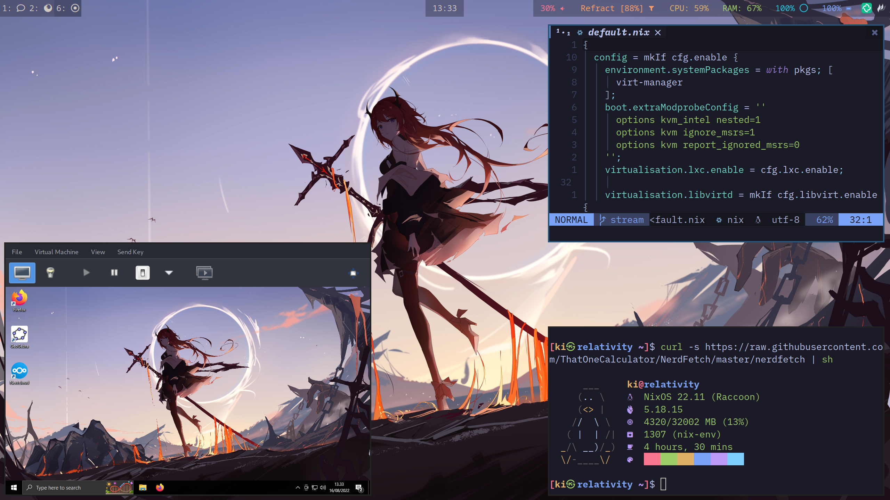
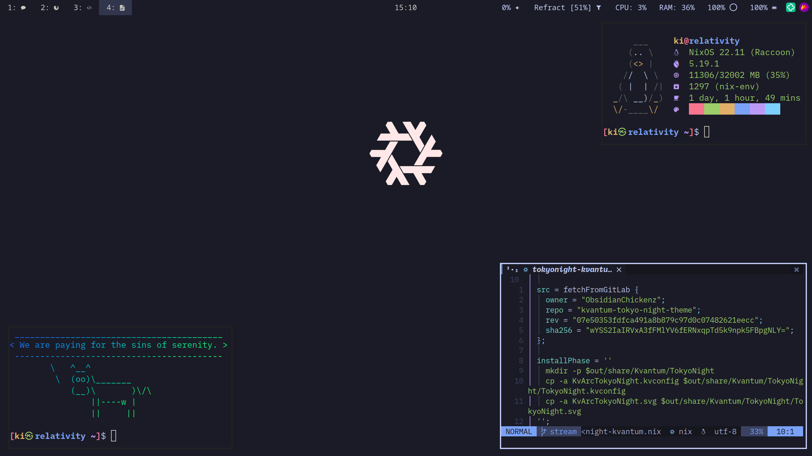

# Dotfiles
This is a git repo containing my personal NixOS system and user configurations.
Currently it only serves my T480, and I'll have to migrate my server's config to here.

# Deprecation notice.. kind of
I put macOS on my T480 and don't use NixOS as of now except for my server (which I'll keep private just to have more ease with secrets management)
I might convert this repo to serve my nix-darwin configuration though.

## Inspiration // Credit
This repository is inspired by jordanisaacs' [dotfiles](https://github.com/jordanisaacs) repo over at GitHub, Files under `lib/` are mostly taken from his repo, and some `modules/`, but I've added a few of my own.

## Showcase

